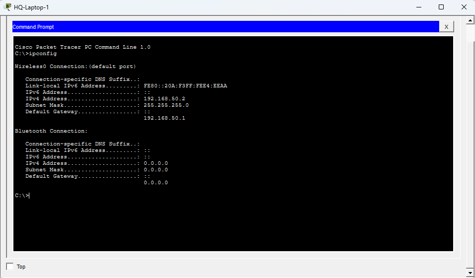
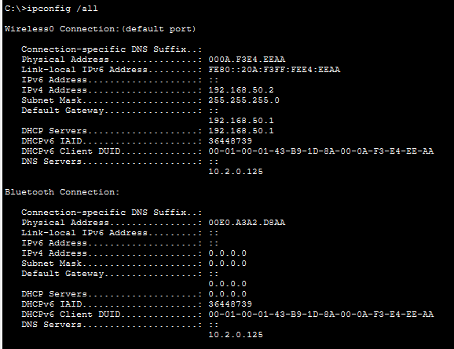
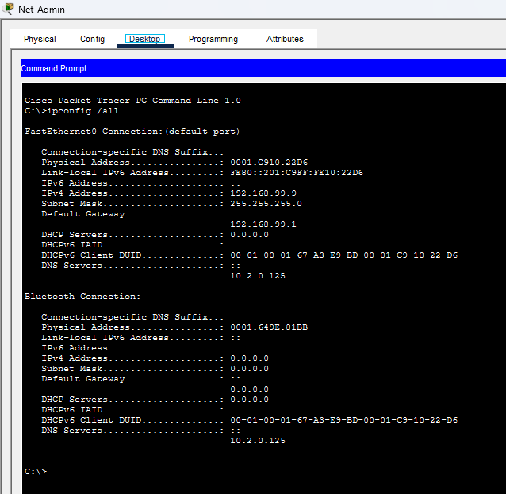
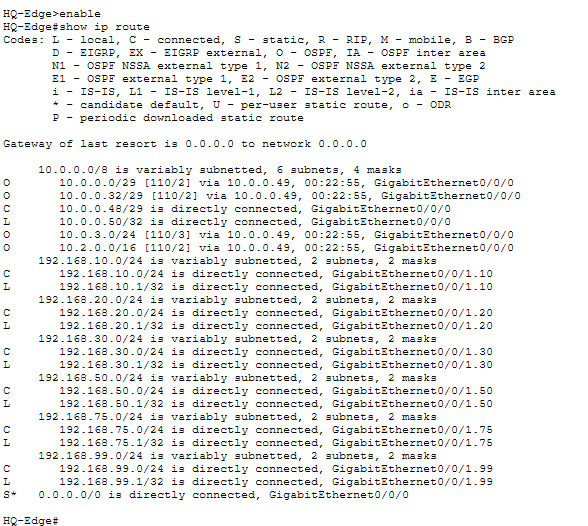
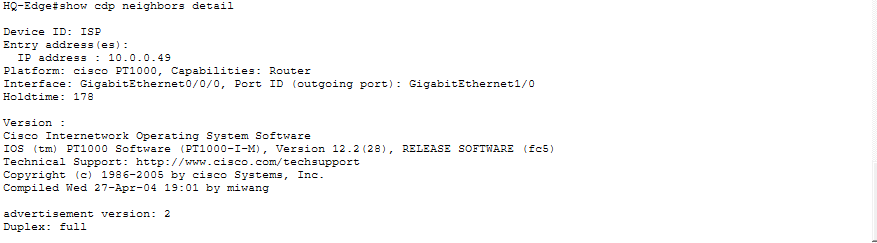
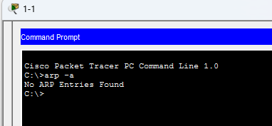
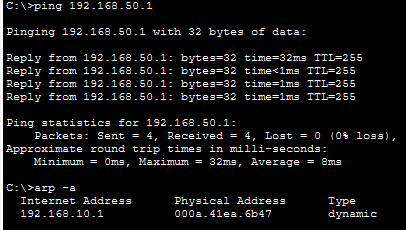
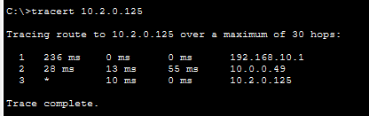
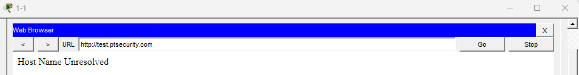
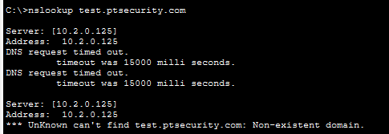

# Laboratorio de Auditoría de Red, Enrutamiento y Diagnóstico DNS en Cisco Packet Tracer

## Descripción General
Este repositorio documenta el desarrollo y resolución de un laboratorio práctico enfocado en la auditoría de redes, verificación de tablas de enrutamiento estáticas y dinámicas (OSPF), descubrimiento de dispositivos vecinos mediante protocolos propietarios, análisis de resolución de direcciones físicas (ARP), trazado de rutas (traceroute) y diagnóstico avanzado de fallas en servicios de nombres de dominio (DNS).

---

## Pasos del Laboratorio y Evidencias

### Parte 1: Verificación de Interfaces y Configuración IP (Endpoints)

#### 1. Configuración de Red en Dispositivo Inalámbrico (`HQ-Laptop-1`)
Verificamos la asignación de dirección IPv4, máscara de subred y puerta de enlace predeterminada en el equipo del usuario.

* **Comando ejecutado:** `ipconfig`
* **Evidencia:** 
* **Perspectiva de Ciberseguridad:** Permite validar la correcta segmentación lógica inicial del host dentro de la red inalámbrica corporativa.

#### 2. Auditoría Completa de Parámetros de Red (`HQ-Laptop-1`)
Consultamos la información detallada de direcciones físicas (MAC), servidores DHCP y servidores DNS asignados.

* **Comando ejecutado:** `ipconfig /all`
* **Evidencia:** 
* **Perspectiva de Ciberseguridad:** Esencial para auditar la configuración de direccionamiento estático/dinámico y corroborar a qué servidor DNS primario derivan las consultas los usuarios.

#### 3. Auditoría de Parámetros de Red en Estación de Administración (`Net-Admin`)
Inspeccionamos la configuración de red detallada de la consola de administración.

* **Comando ejecutado:** `ipconfig /all`
* **Evidencia:** 
* **Perspectiva de Ciberseguridad:** Valida las interfaces activas y la correcta segmentación de los equipos con privilegios de gestión en la infraestructura.

---

### Parte 2: Verificación de Enrutamiento y Conectividad Perimetral

#### 1. Tabla de Enrutamiento en el Router de Borde (`HQ-Edge`)
Verificamos las rutas conectadas directamente, las aprendidas mediante OSPF (O) y la ruta estática predeterminada hacia el proveedor de servicios (S*).

* **Comando ejecutado:** `show ip route`
* **Evidencia:** 
* **Perspectiva de Ciberseguridad:** Permite auditar el Gateway de última instancia y confirmar que el tráfico desconocido se enruta correctamente a través de la interfaz perimetral hacia el exterior.

#### 2. Descubrimiento de Vecinos (CDP)
Mapeamos la topología física y obtuvimos información detallada del router adyacente del proveedor (ISP).

* **Comando ejecutado:** `show cdp neighbors detail`
* **Evidencia:** 
* **Perspectiva de Ciberseguridad:** Vital para el reconocimiento físico de la red y la auditoría de versiones de firmware de dispositivos adyacentes, evaluando riesgos de filtración de información en puertos perimetrales.

---

### Parte 3: Análisis de Capa 2, Caché ARP y Traza de Ruta

#### 1. Auditoría de la Caché ARP en Host (`PC 1-1`)
Comprobamos el comportamiento dinámico de la tabla ARP antes y después de generar tráfico ICMP en la red local.

* **Estado inicial (Caché vacía):**
  * **Comando:** `arp -a`
  * **Evidencia:** 
* **Estado posterior al tráfico (Resolución exitosa):**
  * **Comandos:** `ping 192.168.50.1` seguido de `arp -a`
  * **Evidencia:** 
* **Perspectiva de Ciberseguridad:** Monitorear las entradas ARP ayuda a detectar anomalías lógicas y posibles ataques de suplantación de identidad (ARP Spoofing) en el segmento local.

#### 2. Trazado de Ruta hacia el Servidor DNS (`tracert`)
Analizamos los saltos intermedios seguidos por un paquete IP hasta alcanzar el servidor corporativo.

* **Comando ejecutado:** `tracert 10.2.0.125`
* **Evidencia:** 
* **Perspectiva de Ciberseguridad:** Permite validar la integridad de las rutas de Capa 3 y asegurar que el tráfico atraviesa los dispositivos de seguridad previstos sin bucles de enrutamiento.

---

### Parte 4: Detección y Diagnóstico de Incidentes (Troubleshooting)

#### 1. Falla de Resolución en el Navegador Web
Simulamos un reporte de usuario donde el acceso a recursos mediante URL falla sistemáticamente.

* **Acción:** Intento de carga de `http://test.ptsecurity.com` en el navegador del equipo.
* **Evidencia:** 
* **Perspectiva de Ciberseguridad:** Permite aislar problemas de capa de aplicación y diferenciar fallas físicas de conectividad de aquellos errores derivados de configuraciones lógicas o servicios de nombres.

#### 2. Diagnóstico Definitivo con `nslookup`
Consultamos directamente al servidor DNS asignado para identificar el origen raíz de la falla.

* **Comando ejecutado:** `nslookup test.ptsecurity.com`
* **Evidencia:** 
* **Resultado del Diagnóstico:** Aunque la conectividad de red y las rutas hacia el servidor DNS operan correctamente, la consulta expira y arroja un error de dominio no existente (Non-existent domain), confirmando un fallo lógico en los registros de la zona DNS o ausencia del recurso en el servidor corporativo.

---

## Conclusiones
Este laboratorio permitió aplicar un enfoque metodológico estructurado de resolución de problemas (troubleshooting), combinando comandos de auditoría en equipos de red con herramientas de diagnóstico de sistemas operativos en endpoints. Esto demuestra competencias sólidas en análisis de tráfico, resolución de incidentes de red y verificación de servicios críticos para entornos SOC y de administración de infraestructura.
